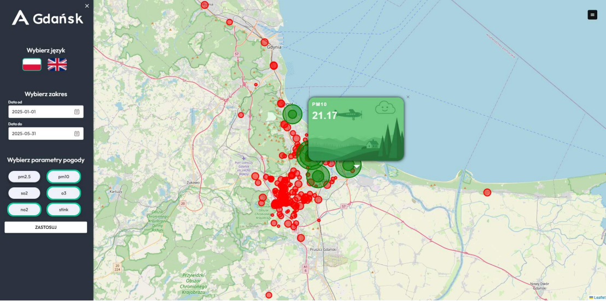
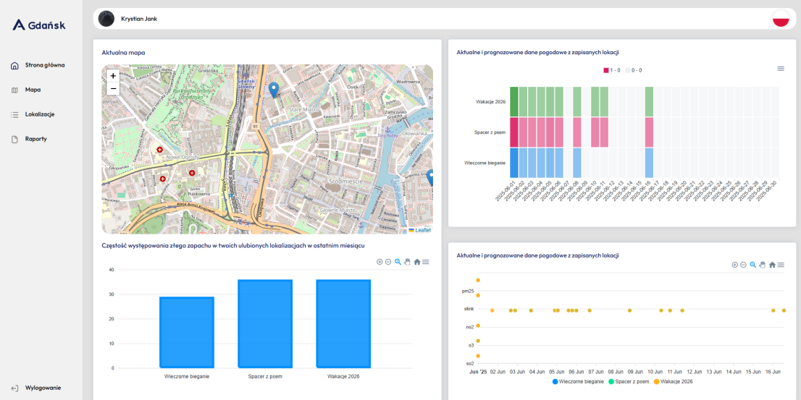
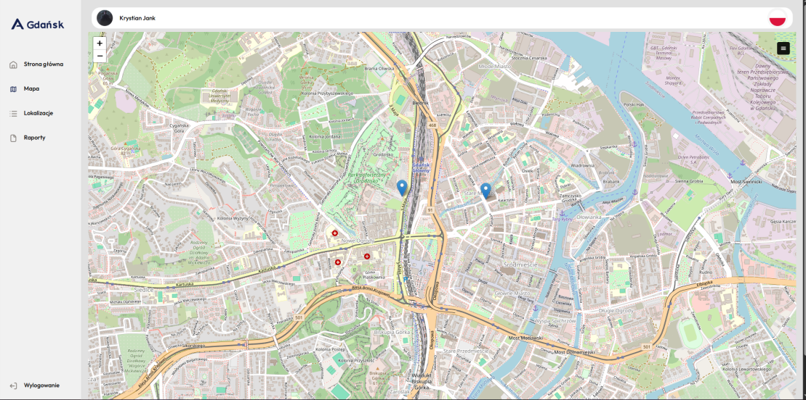
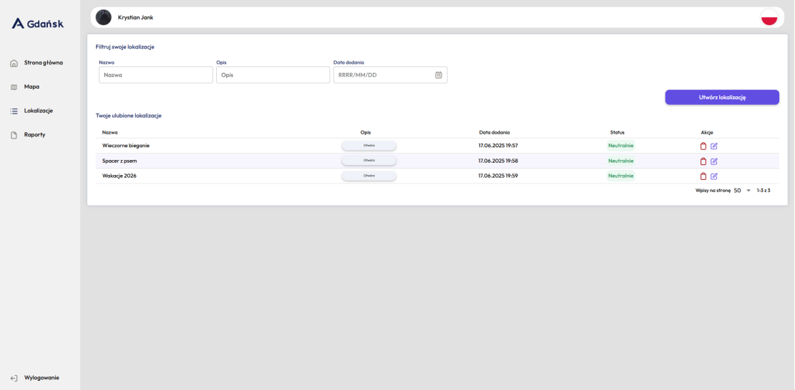
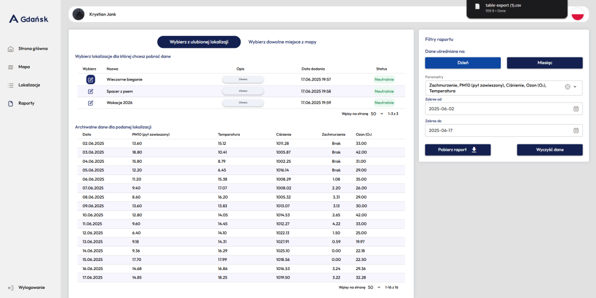
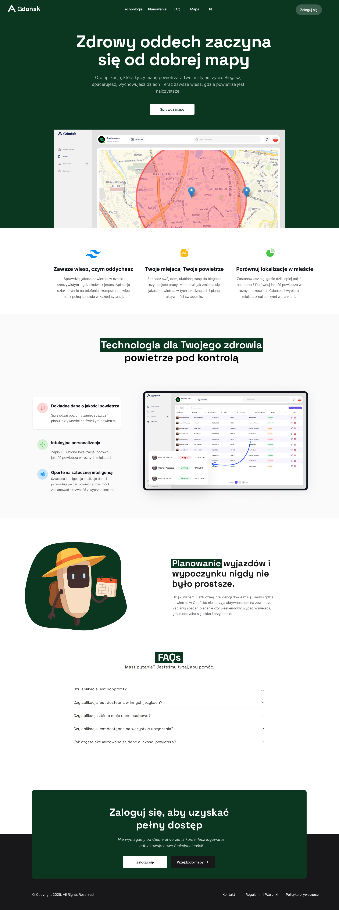

# AirSense Gdansk Web App

AirSense Gdansk Web App is a fully responsive web application for monitoring air quality in Gdansk. It provides detailed information about air pollution, weather conditions, and allows users to explore locations with environmental alerts.  

> **Note:** This repository contains only the frontend application. The backend, responsible for providing air quality and weather data, runs separately and exposes API endpoints consumed by this app. Weather and air quality data are provided by the **City of Gdansk**.  

## Features

- Multilingual support using i18n – switch between different languages.  
- Interactive weather maps with [Leaflet](https://leafletjs.com) displaying pollution and weather data.  
- Endangered locations – highlight areas with poor air quality.  
- Favorite locations – save and quickly access locations of interest.  
- Detailed historical data and charts – retrieve past air quality data and analyze trends.  
- Fully responsive design powered by **Quasar Framework**.  
- Frontend communicates with backend API using **Axios** and state management with **Pinia**.  
- Educational tool – allows users to explore air quality data in-depth.

## Tech Stack

- **Frontend:** Vue.js with Quasar Framework, Pinia, Axios  
- **Maps:** Leaflet.js  
- **Internationalization:** i18n  
- **Charts & Data Visualization:** Custom charts for air pollution trends  
- **Responsive UI:** Fully responsive design with Quasar  

## Usage

1. Clone the repository:  
```bash
git clone <repo-url>
cd <project-folder>
npm install
npm start
```
## Screenshots

<div style="display: flex; flex-wrap: wrap;">
  
  
  
  
  
</div>
  
